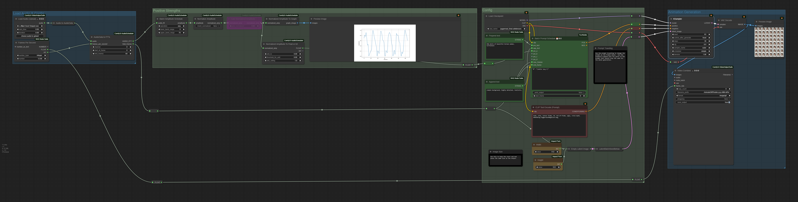
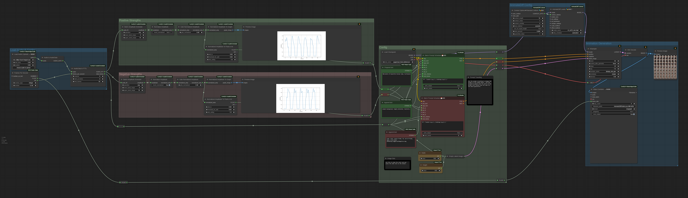

# ComfyUI-AudioScheduler

Features:
- Loading mp3 or wav files
- Reading the amplitude over time
- Previewing the shape of the graph

This repository contains a collection of audio processing nodes that are part of the AudioScheduler project. These nodes can be used to perform various operations on audio data, such as loading audio, performing Fast Fourier Transforms (FFTs), and manipulating amplitude data.  You can use them to control animations in your AI generation

# Install

Install using the ComfyUI Manager.  Look for ComfyUI-AudioScheduler.

# Nodes

## LoadAudio

**Input Types:**

- `audio`: A list of audio file names to be loaded. Supported formats: mp3, wav.

**Output Types:**

- `AUDIO`: Loaded audio data.

**Description:**

The `LoadAudio` class is responsible for loading audio files from a specified directory. It supports both MP3 and WAV formats and returns the loaded audio data.

## AudioToFFTs

**Input Types:**

- `audio`: An instance of loaded audio data.
- `channel`: An integer specifying the audio channel.
- `frames_per_second`: An integer specifying the number of frames per second.

**Output Types:**

- `AUDIO_FFT`: Fast Fourier Transform data for the specified audio channel.
- `INT`: Total number of frames.

**Description:**

The `AudioToFFTs` class performs FFT on the audio data to obtain frequency information. You can specify the channel, frames per second, and other parameters.

## AudioToAmplitudeGraph

**Input Types:**

- `audio`: An instance of loaded audio data.
- `channel`: An integer specifying the audio channel.
- `lower_band_range`: An integer specifying the lower band range.
- `upper_band_range`: An integer specifying the upper band range.

**Output Types:**

- `IMAGE`: A graph displaying the amplitude in the specified frequency range.

**Description:**

The `AudioToAmplitudeGraph` class creates a graph of the amplitude in a specified frequency range for visualization purposes.

## BatchAmplitudeSchedule

**Input Types:**

- `audio_fft`: A list of FFT data.
- `operation`: A string specifying the operation (avg, max, sum).
- `lower_band_range`: An integer specifying the lower band range.
- `upper_band_range`: An integer specifying the upper band range.

**Output Types:**

- `AMPLITUDE`: Amplitude data.

**Description:**

The `BatchAmplitudeSchedule` class calculates amplitude values from FFT data based on the specified operation and frequency range.  You can select different frequency ranges with the lower and upper band ranges.

The different operations will specific how to aggregate the amplitude within that band range.

## ClipAmplitude

**Input Types:**

- `amplitude`: Amplitude data to be clipped.
- `max_amplitude`: An integer specifying the maximum allowed amplitude value.
- `min_amplitude` (Optional): An integer specifying the minimum allowed amplitude value (default is 0).

**Output Types:**

- `AMPLITUDE`: Clipped amplitude data.

**Description:**

The `ClipAmplitude` class is used to clip the amplitude values of audio data. You can specify the maximum and optional minimum allowed amplitude values. Any amplitude values exceeding the specified range will be clipped to the range.

## TransientAmplitudeBasic

**Input Types:**

- `amplitude`: Amplitude data to be adjusted.
- `frames_to_attack` (Optional): An integer specifying the number of frames for attack (default is 0).
- `frames_to_hold` (Optional): An integer specifying the number of frames for holding (default is 6).
- `frames_to_release` (Optional): An integer specifying the number of frames for release (default is 6).

**Output Types:**

- `AMPLITUDE`: Adjusted amplitude data.

**Description:**

The `TransientAmplitudeBasic` class is designed to adjust amplitude data with transient characteristics. You can control the attack, hold, and release behavior by specifying the number of frames for each stage. This node is especially useful for shaping the envelope of the amplitude.

The modifications are applied in the priority of attack -> hold -> release, which ever will apply first.

Attack: The attack applies if the next frame's amplitude is rising.  The larger the number, the longer it'll take to rise to that frame's amplitude.  An attack of 0 will instantly jump to the next frame's amplitude if it's rising.

Hold: 
The hold applies if the next frame's amplitude is falling. The larger the number, the longer it'll hold at the current amplitude.  If the next frame is rising, it'll go back to attacking, and reset the hold count.

Release:
The release applies if the next frame's amplitude is falling and after all the hold frame are done. The larger the number, the longer it'll take to fall to the next amplitude.

The attack and release are applied on a linear scale (though the target amplitude is chosen greedily for simplicity.  You may find it's not quite linear depending on your amplitude wave.)

**Note:** 
- A negative value for frames (frames_to_attack, frames_to_hold, frames_to_release) is not allowed.
- If no frames are specified for attack, hold, or release, the input amplitude data remains unchanged.

## NormalizeAmplitude

**Input Types:**

- `amplitude`: Amplitude data.

**Output Types:**

- `NORMALIZED_AMPLITUDE`: Normalized amplitude data.

**Description:**

The `NormalizeAmplitude` class normalizes the amplitude data, optionally inverting the normalized values.

## GateNormalizedAmplitude

**Input Types:**

- `normalized_amp`: Normalized amplitude data.
- `gate_normalized`: A float value (0.0 to 1.0) for gating.

**Output Types:**

- `NORMALIZED_AMPLITUDE`: Gated normalized amplitude data.

**Description:**

The `GateNormalizedAmplitude` class gates the normalized amplitude data based on the specified threshold.

## Normalized Amplitude Driven String

The `NormalizedAmplitudeDrivenString` class is part of the AudioScheduler project and is designed for generating text prompts based on audio amplitude data. This class allows you to create a dynamic string of text driven by changes in the normalized amplitude of audio signals.

**Input Types:**

- **text**: A list of prompts. One prompt per newline.
- **normalized_amp**: Normalized amplitude data.
- **triggering_threshold**: A floating-point value (between 0.0 and 1.0) representing the triggering threshold for amplitude changes.
- **loop** (Default: True): A boolean value that determines whether the text prompts should loop when there are more keyframes than prompts.
- **shuffle** (Default: False): A boolean value that controls whether the text prompts should be shuffled randomly.

**Output Types:**

The class produces a string output containing text prompts.

**Description:**

The `NormalizedAmplitudeDrivenString` class converts amplitude data and text prompts into a dynamic text string. It does so by identifying keyframes in the amplitude data where the normalized amplitude exceeds the triggering threshold. These keyframes are used to trigger text prompts.

The behavior can be customized using optional inputs:
- If `loop` is set to `True`, the text prompts will loop when there are more prompts than keyframes.
- If `shuffle` is set to `True`, the text prompts will be randomly shuffled.

**Example:**

In this example, when the graph is above 0.6, it'll switch to the next prompt in the list. It'll shuffle the full list of prompts and loop through them all.

## NormalizedAmplitudeToNumber

**Input Types:**

- `normalized_amp`: Normalized amplitude data.

**Output Types:**

- `FLOAT`: Normalized amplitude values as floats.
- `INT`: Normalized amplitude values as integers.

**Description:**

The `NormalizedAmplitudeToNumber` class converts normalized amplitude data to float or integer values.

## NormalizedAmplitudeToGraph

**Input Types:**

- `normalized_amp`: Normalized amplitude data.

**Output Types:**

- `IMAGE`: A graph displaying the normalized amplitude data.

**Description:**

The `NormalizedAmplitudeToGraph` class generates a graph to visualize the normalized amplitude data.

## AmplitudeToNumber

**Input Types:**

- `amplitude`: Amplitude data.

**Output Types:**

- `FLOAT`: Amplitude values as floats.
- `INT`: Amplitude values as integers.

**Description:**

The `AmplitudeToNumber` class converts amplitude data to float or integer values.

## AmplitudeToGraph

**Input Types:**

- `amplitude`: Amplitude data.

**Output Types:**

- `IMAGE`: A graph displaying the amplitude data.

**Description:**

The `AmplitudeToGraph` class generates a graph to visualize the amplitude data.

Feel free to explore and use these nodes for your audio processing tasks. Detailed documentation for each node is available within the code and can be accessed as needed.

# Example

## Basic Example

Takes an audio file, finds the amplitude within a frequency range, normalizes it and sends it off.

Result:

## Using multiple frequency ranges

We can use the amplitude to power one set of conditions. And the inverse to power another set.

You can use different frequencies bands to power different conditions both in the positive and negative prompts.

